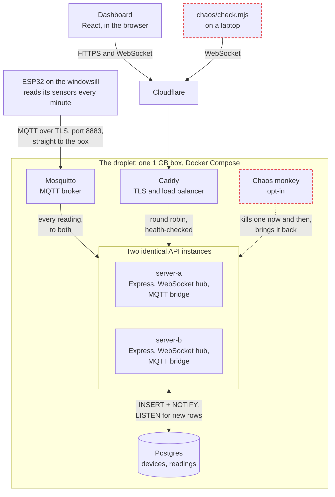
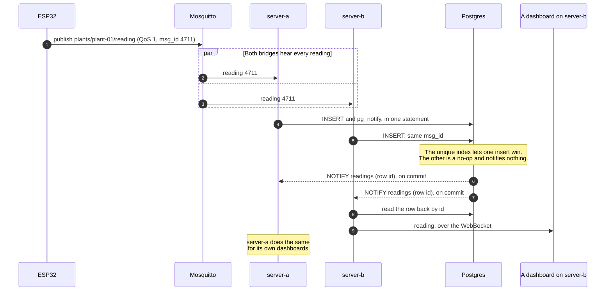
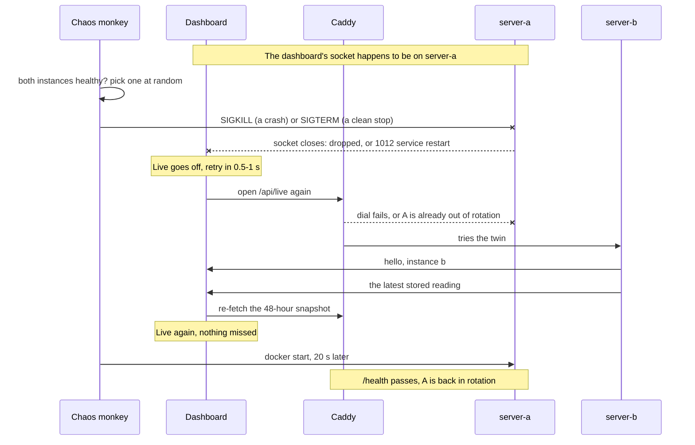

# Plant vitals

One houseplant, watched far harder than it needs. An ESP32 on the windowsill
measures soil moisture, air temperature and humidity every minute, and the
dashboard at **https://plant.juhawilppu.com** shows each reading the moment it
lands.

A minute's poll against a single server would do the job. This project is
over-engineered on purpose, as a place to build things properly:

- the node publishes over **MQTT**, with a Last Will, a retained status and
  at-least-once delivery
- each reading is pushed to the dashboard over a **WebSocket** instead of polled
- the API runs as **two instances** behind a load balancer, both fed by Postgres
  `LISTEN/NOTIFY`
- a **chaos monkey** kills one of them at random, and a checker proves that no
  dashboard noticed

Hardware, parts list and wiring: **`docs/hardware.md`**.

---

## How it works



1. The **ESP32** reads its sensors once a minute and publishes the reading to
   **Mosquitto** over MQTT with TLS. It connects to the box directly, because
   Cloudflare only carries HTTP.
2. Both **API instances** receive every reading and race to insert it into
   **Postgres**. The unique index on `(device_id, msg_id)` lets exactly one
   insert win.
3. The winning insert raises a `NOTIFY` in the same statement. **Both**
   instances `LISTEN`, read the new row back, and push it down every WebSocket
   they hold.
4. The **dashboard** loads 48 hours over HTTP once, then adds whatever the
   socket pushes. It reaches the instances through **Cloudflare** and
   **Caddy**, which round-robins between them and skips one whose `/health`
   fails.
5. The **chaos monkey**, when released, kills one instance at random every few
   minutes. The dashboards on that instance reconnect to the other one, and
   **`chaos/check.mjs`** proves nothing was missed.

### One reading, from the windowsill to the screen



server-b lost the race, and its dashboards still get the reading. Before
`LISTEN/NOTIFY`, only the instance that won the insert pushed it, so each
dashboard silently missed whatever its own instance lost the race for.

### When the monkey kills an instance



The WebSocket itself does not survive: it is a TCP connection owned by the
process that died. What survives is the stream. The page reconnects within
about a second, and the re-fetch covers anything stored while it was away.

### Where things live

| Path | What |
|---|---|
| `firmware/plant_node/` | The ESP32 sketch |
| `mosquitto/config/` | Broker config, and the ACL that gives the node and the bridge opposite rights |
| `server/index.js` | The API: `GET /api/readings`, `/api/history`, `/api/devices`, `POST /api/readings` (kept for curl and as a fallback), `/health`; also serves the built dashboard |
| `server/mqtt-bridge.js` | Subscribes to the broker and hands each reading to `ingest()` |
| `server/feed.js` | The Postgres `LISTEN` that tells each instance about every new row |
| `server/live.js` | The WebSocket hub on `/api/live` |
| `db/schema.sql` | `devices`, one row per node with its soil calibration, and `readings`, an append-only log |
| `web/` | The dashboard: Vite, React, hand-rolled SVG charts |
| `caddy/Caddyfile` | TLS, and the load balancer in front of the two instances |
| `chaos/` | `monkey.sh`, which kills instances, and `check.mjs`, which proves the dashboards did not notice |
| `deploy.sh`, `sync-certs.sh` | The deploy, and keeping the broker's certificate fresh |

---

## Why it is built this way

### Live updates, given a minute's poll would do

The dashboard does not poll. It fetches its 48 hours over HTTP once, then
listens on `/api/live` for each new reading. That is overkill for a plant, and
kept anyway, because this project is over-engineered on purpose. What makes it
more than a socket bolted on:

- **One path in.** MQTT and the HTTP fallback both go through `ingest()` in
  `server/index.js`, which writes the row and raises a Postgres `NOTIFY` for it
  in the same statement. Every instance listens and pushes the row to its own
  sockets. A duplicate that the dedup index swallows raises nothing, and a
  `NOTIFY` is only delivered on commit, so the socket never shows anything the
  database does not hold.
- **The snapshot is the truth; the socket only adds to it.** A reconnect
  re-fetches the snapshot, because whatever arrived while the socket was down
  exists only in the database.
- **No gap at page load.** The history fetch and the socket open at about the
  same moment, and a reading could land between them. On connect the server
  sends the latest stored reading first, which is the only one that can fall
  into that gap.
- **Two heartbeats, one timer.** Every 30 s the server pings each client, so sockets
  that vanished get freed, and sends a heartbeat message, so a browser can tell
  its own socket died silently (the usual state after a laptop sleeps) and
  reconnect. It also keeps the connection under Cloudflare's 100-second idle
  timeout when the node is offline.
- **Polling as the fallback.** While the socket is down, the page polls every
  minute, so a network that blocks WebSockets costs freshness, not data. The
  header says **Live** only while the socket is up.

Watching it from a terminal (Node 22 has a WebSocket client built in):

```sh
node -e "new WebSocket('wss://plant.juhawilppu.com/api/live').onmessage = (e) => console.log(e.data)"
```

### Two instances, and a chaos monkey to keep them honest

The API runs twice on the one box, as `server-a` and `server-b`, from the same
image. Caddy round-robins between them, checks `/health` on each every two
seconds, and retries a request that dials a dead one on the other. A houseplant
needs none of this.

**What survives is the stream, not the connection.** When an instance dies, the
sockets it held die with it. The promise is about what the dashboard shows:

- no reading is missing, and none is shown twice
- the page is back to **Live** within a couple of seconds

The **Live** badge blinks off for that second or so, on purpose. It says Live
only while the socket is up, and for that second it is not.

**The bug a second instance would have brought.** Each instance runs its own
MQTT bridge, so both receive every reading and both race to insert it. The
dedup index lets exactly one win, and originally only the winner pushed the
reading to its sockets. Every dashboard would have missed, live, each reading
its own instance lost the race for: 13 of 59 in the test below. The monkey
would also have hidden this: every kill forces a
reconnect, the reconnect re-fetches the snapshot, and the re-fetch fills in
what the socket dropped. So the push now comes from Postgres instead
(`server/feed.js`). `ingest()` raises a `NOTIFY` in the same statement as the
insert, and every instance `LISTEN`s. An instance that loses that connection
cannot hear readings, and it does three things until it has the connection
back:

- it closes its sockets, so those dashboards re-fetch and reconnect elsewhere
- it refuses new ones with a 503
- it fails `/health`, which takes it out of Caddy's rotation

Both bridges still subscribe to everything, on purpose. The double delivery
costs one no-op insert per reading, and it means readings are still stored
while either instance is dead.

**Stopping cleanly.** `docker stop` sends SIGTERM, which Node running as a
container's PID 1 used to ignore, so every stop waited out Docker's ten
seconds and ended in a SIGKILL. Now an instance closes its sockets with
`1012 service restart`, refuses new connections so Caddy retries them on its
twin, and exits. That is what lets `deploy.sh` restart the two one at a time.

**The monkey** only strikes while both instances are healthy, so it never
kills the last one standing. Half the time it sends SIGKILL, which is a
crash, and half the time SIGTERM, which is a clean stop. It brings its victim
back itself, because Docker treats `docker kill` as a manual stop and the
restart policy would leave it down. It needs the Docker socket, which is root
on the host in all but name, so it lives behind a compose profile of its own
and runs only when asked to:

```sh
ssh root@185.14.186.98 "cd /opt/plant-vitals && docker compose --profile server --profile chaos up -d chaos"
ssh root@185.14.186.98 "docker logs -f plant-vitals-chaos"
ssh root@185.14.186.98 "cd /opt/plant-vitals && docker compose --profile server --profile chaos rm -sf chaos"
```

It strikes every 2-10 minutes and keeps its victim down for 20 s. To change
that, set `CHAOS_MIN_S`, `CHAOS_MAX_S` and `CHAOS_DOWN_S` in `.env`.

**The checker** (`chaos/check.mjs`) is how to tell whether the dashboards
noticed. Watching the dashboard would not tell you: its re-fetch covers
exactly the failure being tested for. So the checker holds a socket of its
own, reconnects the way the page does, and afterwards compares what arrived
against the database:

```sh
node chaos/check.mjs https://plant.juhawilppu.com --minutes 60
```

It sorts every reading stored while it watched into one of three groups:

- **arrived**: the reading came over the socket
- **between**: it was stored during a reconnect, and the page's re-fetch
  covers it
- **missed**: it was stored between two readings that one connection did
  receive, so that connection was open and should have had it

**missed** must be 0, and so must anything that arrived but is not in the
database. The run exits 1 otherwise. Judging by position rather than
timestamp means it needs no clock in common with the server.

Measured on a local copy of the stack, with a fake node publishing every 2 s
and the monkey on a 15-30 s fuse:

| Run | Readings | Missed | Reconnects |
|---|---|---|---|
| The code before LISTEN/NOTIFY, as two instances | 59 | **13** | - |
| This code, 5 min, 8 kills | 133 | **0** | 0.7-1.0 s |
| This code, feed connections cut, then a rolling restart | 53 | **0** | 0.7-2.5 s |

The first run shows the bug was real. The page's re-fetch would have covered
every one of those 13, so the dashboard itself would have looked fine. The
2.5 s reconnect is the feed-cut case. Both instances went deaf together, and
Caddy held the connection until one of them was listening again, rather than
refusing it.

### Why MQTT, given the volume does not need it

1,440 rows a day does not justify a broker on operational grounds, and the HTTP
endpoint that predates this still works. MQTT is here for what it makes possible
rather than what it relieves:

- **Fan-out.** The node publishes to a topic and does not know its consumers, so
  a second one - Home Assistant, a phone, a `mosquitto_sub` in a terminal - costs
  nothing and needs no firmware change.
- **Last Will.** The broker publishes `offline` on the node's behalf when its
  connection dies, so the system reports its own death instead of the dashboard
  inferring it from missing rows.
- **Retained messages.** Whatever subscribes at 3am gets the last value at once
  rather than waiting up to a minute.
- **One persistent connection** with keepalives, instead of a fresh TLS handshake
  every cycle - which is the expensive part, and would decide battery life.

QoS 1 is at-least-once, so the broker may redeliver and the same reading can
arrive twice. That is what `msg_id` and the unique index on
`(device_id, msg_id)` are for: the insert is idempotent, and a duplicate is a
no-op rather than a second row.

The bridge trusts the **topic** for device identity, not the `device_id` in the
payload, because the ACL is written in terms of topics - trusting the body would
let one node write history for another.

| Topic | What |
|---|---|
| `plants/<device>/reading` | The measurement, as JSON, at QoS 1 |
| `plants/<device>/status` | `online` or `offline`, retained, and set as the node's Last Will |

### Calibration lives in the database, not the firmware

The node sends the **raw 12-bit ADC value** and the server converts it to a
percentage using `soil_raw_air` and `soil_raw_water` on the device row. Two
consequences, both wanted: recalibrating a probe is an `UPDATE` rather than a
reflash, and a recalibration fixes the **whole history** retroactively rather
than leaving a discontinuity on the day it changed.

Until those two columns are filled, the API returns `soil_pct: null` and the
dashboard says so instead of showing a fabricated number. An uncalibrated
capacitive reading genuinely does not mean anything.

---

## The dashboard

Two pages, and the split is the design. **Now** (`/`) answers "does the plant
need anything?"; **the long view** (`#/history`) answers "what has been
happening?". Every measure appears exactly once on each, in the form that page
needs - the same number never gets a tile *and* a chart on one screen.

- **Now** is the last 48 hours: one hero figure, three stat tiles, and a
  sparkline under each as a trend cue only. Anything with axes lives on the
  other page. 48 hours because that is the window where a reading still implies
  an action - long enough to show last night as well as this one.
- **The long view** is 1 / 3 / 6 / 12 months or all time, bucketed server-side by
  `GET /api/history`. A year is ~525k rows, so the server sends one average per
  bucket with that bucket's low and high, and the chart draws the average as the
  line and the spread as a band behind it.
- **Buckets snap to whole days past a fortnight.** A sub-day bucket still
  straddles the day/night cycle, so the line keeps swinging mark to mark and
  fills in solid once the marks are a pixel apart. At daily buckets the line is
  the daily mean, which actually trends, and the swing moves into the band.
- **No dual-axis charts.** Temperature and humidity are different scales, so they
  are different charts. Two y-axes on one plot is the single most misleading
  thing a monitoring dashboard can do.
- **One hero figure**, soil moisture, because it is the only reading that implies
  an action. The verdict beside it ships an icon *and* words, never colour alone,
  and it does not appear at all until there is a reading to have a verdict about.
- **No value is encoded by hue alone.** The light-mode aqua sits below
  3:1 against the surface, so that relief is required rather than decorative: on
  *now* every measure states its value as text beside its colour key, and on the
  long view every chart carries a direct end-label.
- **Charts hold their previous render at reduced opacity while refetching** - no
  skeleton flash, no layout jump.
- Colours are the first three slots of a validated categorical palette, fixed per
  metric so a filter can never repaint them. Worst adjacent CVD separation 9.1
  light / 8.4 dark, measured across four; the fourth, yellow, left with the
  broken light sensor.
- **Light is not shown.** The BH1750 is broken and is not being replaced. The
  firmware and API still carry `lux`, so a working sensor would only need the
  tile and the chart back.

---

## Running it locally

```sh
cp .env.example .env          # then: openssl rand -hex 24  -> INGEST_TOKEN
docker compose --profile server up -d postgres   # schema applied on first boot

cd server && npm install && cd ..
node server/seed-demo.js      # a week of plausible fake readings, for the UI

set -a; . ./.env; set +a
node server/index.js          # API on :8090

cd web && npm install && npm run dev   # dashboard on :5173, proxies /api to 8090
```

`--profile server` is needed even though only Postgres starts: Caddy depends on
the API instances, which live in that profile, and compose rejects the whole
file when it cannot see them.

For a production-shaped run instead, `npm run build` in `web/` and the API serves
the built dashboard itself at `http://localhost:8090/`. The checker works
against it too, as long as readings are arriving:

```sh
node chaos/check.mjs http://localhost:8090
```

Watching the live stream, which is the debugging ergonomics MQTT buys:

```sh
ssh root@185.14.186.98 "docker exec plant-vitals-mosquitto \
    mosquitto_sub -t 'plants/#' -v -u bridge -P \"\$MQTT_BRIDGE_PASSWORD\""
```

Posting a reading by hand over the HTTP fallback:

```sh
curl -X POST localhost:8090/api/readings \
  -H 'Content-Type: application/json' \
  -H "X-Device-Token: $INGEST_TOKEN" \
  -d '{"device_id":"plant-01","soil_raw":2450,"air_temp_c":21.4,
       "humidity_pct":38.2,"pressure_hpa":1014.6,"lux":812.5,"rssi":-58}'
```

Clearing the demo rows once the real node is posting:

```sh
docker exec plant-vitals-postgres psql -U postgres -d plant_vitals -c 'truncate readings;'
```

---

## The server

Deployed and running on **185.14.186.98** (Ubuntu 24.04, 961 MB of memory and
a 512 MB swapfile, which `deploy.sh` creates when a box has none).

| What | Where |
|---|---|
| Dashboard + API | **https://plant.juhawilppu.com** - via Cloudflare |
| MQTT over TLS | **mqtts://mqtt.juhawilppu.com:8883** |
| MQTT plaintext | 1883, **compose network only** - not published to the host |
| Postgres | **loopback only**, `127.0.0.1:55433` |
| API direct | `127.0.0.1:8090` (server-a) and `:8091` (server-b) on the box; Caddy is the only public route in |
| Project root | `/opt/plant-vitals` |
| Secrets | `/opt/plant-vitals/.env`, mode 600, generated on the box |

### DNS and TLS

Two records in Cloudflare, with deliberately different proxy states:

| Record | Proxy | Why |
|---|---|---|
| `plant` A 185.14.186.98 | **on** (orange) | Dashboard. Cloudflare terminates TLS for browsers, absorbs traffic, hides the origin. |
| `mqtt` A 185.14.186.98 | **off** (grey) | The proxy only carries HTTP/HTTPS on a fixed port list, and 8883 is not on it. A proxied name resolves to Cloudflare's anycast IPs, so an MQTT client would be dialling a port Cloudflare does not answer. Grey resolves straight here. |

Hostnames do not carry port numbers, so one grey record could serve both. Two
records exist so the dashboard can keep the proxy while MQTT bypasses it.

Caddy obtains and renews both certificates automatically, and the two names take
different ACME paths for a reason worth remembering:

- `mqtt` is direct, so **TLS-ALPN-01** works.
- `plant` is proxied, and TLS-ALPN-01 **cannot** work through it - Cloudflare
  terminates the TLS handshake, so the `acme-tls/1` protocol never reaches the
  origin. Caddy falls back to **HTTP-01**, which Cloudflare does forward. This is
  visible in the logs on first issuance: one failed ALPN attempt, then success.

Caddy runs with `auto_https disable_redirects`. An origin that force-redirects
HTTP to HTTPS breaks a Cloudflare zone set to Flexible, because Cloudflare
fetches over HTTP and follows the redirect straight back to itself. Without the
redirect the origin answers whichever protocol Cloudflare uses, so the zone's SSL
mode can change without breaking the site. Currently Cloudflare reaches the
origin over TLS (confirmed in Caddy's access log), so the zone is on Full or Full
(strict).

Mosquitto cannot read Caddy's key - Caddy keeps it root-only in its own volume
and Mosquitto runs as uid 1883 - so `sync-certs.sh` copies the certificate out,
chowns it, and sends Mosquitto a SIGHUP to reload without dropping connections.
`deploy.sh` runs it and installs a nightly cron, because a renewal the broker
never picks up would fail silently 90 days later.

Redeploy with `./deploy.sh`. The React bundle is built **locally** and rsynced:
a vite build is the one step likely to be OOM-killed on a 1 GB box.
Everything else builds in Docker on the server. `.env` and the broker's
`passwd` are excluded from the sync so they survive `--delete`.

The two API instances are replaced **one at a time**, each waiting for its
health check before the next goes, so a deploy no longer takes the dashboard
down. A build that comes up unhealthy stops the deploy at the first instance,
with the second still serving the old code.

Two MQTT accounts, with deliberately asymmetric rights (`mosquitto/config/acl`):

| User | Rights | Used by |
|---|---|---|
| `plantnode` | publish to `plants/#` only | the ESP32 |
| `bridge` | subscribe to `plants/#` only | the API process |

Verified on the live broker: anonymous connections are refused, and `plantnode`
receives **nothing** when it subscribes even though the SUBACK says success -
Mosquitto grants the subscription and filters at delivery, so test the behaviour
rather than the return code.

### What is still open

1. **Confirm Cloudflare's SSL/TLS mode is Full (strict), not Full.** Plain
   *Full* encrypts the Cloudflare-to-origin leg but accepts any certificate,
   including a self-signed or expired one, which leaves that leg
   impersonable. The origin now has a real Let's Encrypt certificate, so strict
   costs nothing.
2. **The read API and dashboard are public.** Only plant telemetry, but readable
   by anyone with the URL.
3. **Every deploy restarts Mosquitto**, which briefly disconnects the node. The
   sync's `--delete` removes `mosquitto/certs/` and
   `mosquitto/config/conf.d/tls.conf`, which exist only on the server. The
   deploy then puts both back and restarts the broker. Excluding the two paths
   from the rsync would make deploys gap-free for the node as well as for the
   dashboard.
